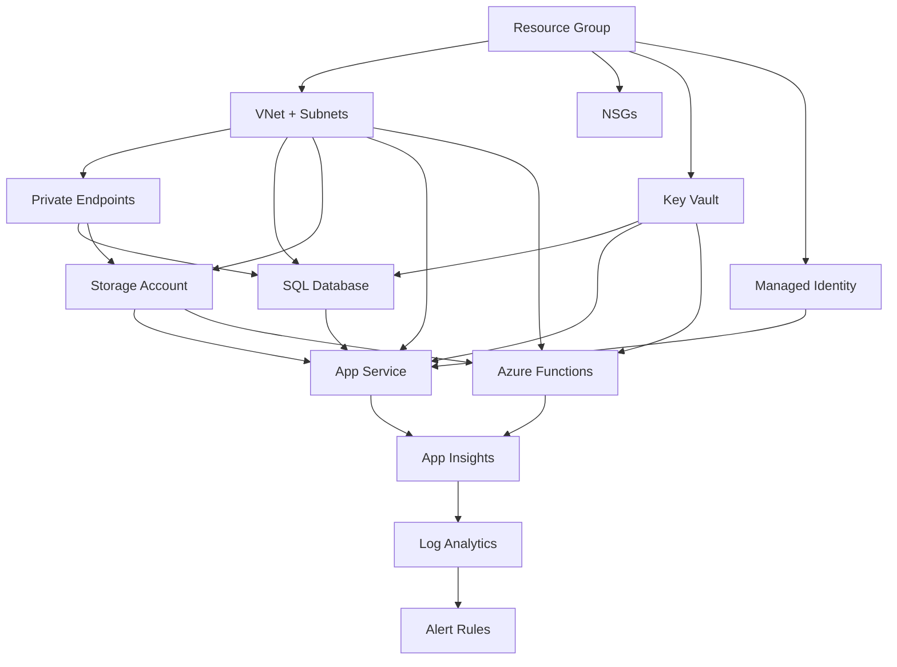

# 🚀 Step 5: Implementation Plan — {{PROJECT_NAME}}


<details open>
<summary><strong>📑 Contents</strong></summary>

- [Architecture Summary](#-architecture-summary)
- [AVM Module Inventory](#-avm-module-inventory)
- [Resource Inventory](#-resource-inventory)
- [Deployment Phases](#-deployment-phases)
- [Dependency Graph](#-dependency-graph)
- [Naming Conventions](#-naming-conventions)
- [Security Configuration Matrix](#-security-configuration-matrix)
- [Module Structure](#-module-structure)
- [azd Configuration](#-azd-configuration)
- [Preflight Considerations](#-preflight-considerations)
- [Approval Gate](#-approval-gate)

</details>

> Generated by IaC Planner agent | {{DATE}}

| ⬅️ Previous | 📑 Index |
|-------------|----------|
| [03-cost-estimate.md](03-cost-estimate.md) | [README](README.md) |

---

## 📋 Architecture Summary

| Parameter | Value |
|-----------|-------|
| Project | {{PROJECT_NAME}} |
| Region | {{REGION}} |
| IaC Tool | Bicep (with AVM modules) |
| Deployment Strategy | <!-- Phased / Single --> |
| Total Resources | <!-- e.g. 12 --> |
| AVM Coverage | <!-- e.g. 10/12 (83%) --> |
| Estimated Deploy Time | <!-- e.g. 15-20 minutes --> |

**Source Architecture:** [02-architecture-assessment.md](02-architecture-assessment.md)
**Budget Reference:** [03-cost-estimate.md](03-cost-estimate.md) — {{BUDGET}}/month

---

## 📦 AVM Module Inventory

| Resource | AVM Module | Version | Status | Notes |
|----------|-----------|---------|--------|-------|
| <!-- e.g. App Service --> | <!-- e.g. avm/res/web/site --> | <!-- e.g. 0.11.0 --> | <!-- ✅ Available / ⚠️ Not found --> | |
| <!-- e.g. SQL Database --> | <!-- e.g. avm/res/sql/server --> | <!-- e.g. 0.9.0 --> | <!-- ✅ Available --> | |
| <!-- e.g. Storage Account --> | <!-- e.g. avm/res/storage/storage-account --> | <!-- e.g. 0.14.0 --> | <!-- ✅ Available --> | |

**Legend:** ✅ AVM available (use module) | ⚠️ No AVM (raw Bicep resource) | 🔄 Deprecated (replacement needed)

---

## 🗂️ Resource Inventory

| # | Resource | Azure Type | AVM/Raw | SKU | Dependencies | CAF Name |
|---|----------|-----------|---------|-----|--------------|----------|
| 1 | <!-- Resource Group --> | `Microsoft.Resources/resourceGroups` | Raw | N/A | None | `rg-{{project}}-{{env}}-{{region}}` |
| 2 | <!-- VNet --> | `Microsoft.Network/virtualNetworks` | AVM | Standard | RG | `vnet-{{project}}-{{env}}-{{region}}` |
| 3 | <!-- Key Vault --> | `Microsoft.KeyVault/vaults` | AVM | Standard | RG, VNet | `kv-{{project}}-{{env}}-{{region}}` |

---

## 🚢 Deployment Phases

### Phase 1: Foundation

| Resource | Type | Estimated Time |
|----------|------|---------------|
| <!-- Resource Group --> | `Microsoft.Resources/resourceGroups` | 30s |
| <!-- VNet + Subnets --> | `Microsoft.Network/virtualNetworks` | 1-2 min |
| <!-- NSGs --> | `Microsoft.Network/networkSecurityGroups` | 30s |

**Dependencies:** None (first phase)

---

### Phase 2: Security

| Resource | Type | Estimated Time |
|----------|------|---------------|
| <!-- Key Vault --> | `Microsoft.KeyVault/vaults` | 1-2 min |
| <!-- Managed Identity --> | `Microsoft.ManagedIdentity/userAssignedIdentities` | 30s |
| <!-- Private Endpoints --> | `Microsoft.Network/privateEndpoints` | 2-3 min |

**Dependencies:** Phase 1 (VNet, Subnets)

---

### Phase 3: Data

| Resource | Type | Estimated Time |
|----------|------|---------------|
| <!-- SQL Server + DB --> | `Microsoft.Sql/servers` | 3-5 min |
| <!-- Storage Account --> | `Microsoft.Storage/storageAccounts` | 1-2 min |

**Dependencies:** Phase 1 (VNet), Phase 2 (Key Vault, Private Endpoints)

---

### Phase 4: Compute

| Resource | Type | Estimated Time |
|----------|------|---------------|
| <!-- App Service Plan --> | `Microsoft.Web/serverfarms` | 1 min |
| <!-- App Service --> | `Microsoft.Web/sites` | 2-3 min |
| <!-- Functions --> | `Microsoft.Web/sites` (kind: functionapp) | 2-3 min |

**Dependencies:** Phase 1 (VNet), Phase 2 (Key Vault, Identity), Phase 3 (SQL, Storage)

---

### Phase 5: Monitoring

| Resource | Type | Estimated Time |
|----------|------|---------------|
| <!-- Log Analytics --> | `Microsoft.OperationalInsights/workspaces` | 1-2 min |
| <!-- App Insights --> | `Microsoft.Insights/components` | 1 min |
| <!-- Alert Rules --> | `Microsoft.Insights/metricAlerts` | 30s |

**Dependencies:** Phase 4 (Compute resources to monitor)

---

## 🔀 Dependency Graph



---

## 📛 Naming Conventions

| Resource | Pattern | Example |
|----------|---------|---------|
| Resource Group | `rg-{project}-{env}-{region}` | `rg-{{project}}-prod-weu` |
| Virtual Network | `vnet-{project}-{env}-{region}` | `vnet-{{project}}-prod-weu` |
| Subnet | `snet-{purpose}-{project}-{env}` | `snet-app-{{project}}-prod` |
| NSG | `nsg-{subnet}-{project}-{env}` | `nsg-app-{{project}}-prod` |
| App Service Plan | `asp-{project}-{env}-{region}` | `asp-{{project}}-prod-weu` |
| App Service | `app-{project}-{env}-{region}` | `app-{{project}}-prod-weu` |
| Function App | `func-{project}-{env}-{region}` | `func-{{project}}-prod-weu` |
| SQL Server | `sql-{project}-{env}-{region}` | `sql-{{project}}-prod-weu` |
| SQL Database | `sqldb-{project}-{env}` | `sqldb-{{project}}-prod` |
| Storage Account | `st{project}{env}{region}` | `st{{project}}prodweu` |
| Key Vault | `kv-{project}-{env}-{region}` | `kv-{{project}}-prod-weu` |
| Log Analytics | `log-{project}-{env}-{region}` | `log-{{project}}-prod-weu` |
| App Insights | `appi-{project}-{env}-{region}` | `appi-{{project}}-prod-weu` |
| Private Endpoint | `pe-{service}-{project}-{env}` | `pe-sql-{{project}}-prod` |
| Managed Identity | `id-{project}-{env}-{region}` | `id-{{project}}-prod-weu` |

> Naming follows [Azure Cloud Adoption Framework](https://learn.microsoft.com/azure/cloud-adoption-framework/ready/azure-best-practices/resource-naming) conventions.

---

## 🔒 Security Configuration Matrix

| Resource | Managed Identity | Private Endpoint | Encryption | Network Isolation |
|----------|-----------------|-----------------|------------|-------------------|
| <!-- App Service --> | System-assigned | N/A (VNet integration) | TLS 1.2+ | VNet integrated |
| <!-- SQL Database --> | N/A (Entra auth) | Yes | TDE + TLS 1.2 | Private only |
| <!-- Storage Account --> | N/A | Yes | SSE (Microsoft-managed) | Private only |
| <!-- Key Vault --> | N/A | Yes | Platform-managed HSM | Private only |
| <!-- Functions --> | System-assigned | N/A (VNet integration) | TLS 1.2+ | VNet integrated |

---

## 📁 Module Structure

```
output/{{project}}/infra/
├── azure.yaml              # azd project configuration
├── main.bicep              # Orchestrator (subscription scope)
├── main.bicepparam         # Parameters (environment-specific)
└── modules/
    ├── networking.bicep    # VNet, subnets, NSGs
    ├── security.bicep      # Key Vault, managed identities, private endpoints
    ├── data.bicep          # SQL Server/DB, Storage Account
    ├── compute.bicep       # App Service Plan, App Service, Functions
    └── monitoring.bicep    # Log Analytics, App Insights, Alert Rules
```

### Module Responsibilities

| Module | Resources | Scope |
|--------|-----------|-------|
| `main.bicep` | Resource Group | Subscription |
| `networking.bicep` | VNet, Subnets, NSGs | Resource Group |
| `security.bicep` | Key Vault, Identities, Private Endpoints | Resource Group |
| `data.bicep` | SQL Server + DB, Storage Account | Resource Group |
| `compute.bicep` | App Service Plan, App Service, Functions | Resource Group |
| `monitoring.bicep` | Log Analytics, App Insights, Alerts | Resource Group |

---

## ⚙️ azd Configuration

The `azure.yaml` file enables deployment via `azd up`:

```yaml
name: {{project}}
metadata:
  template: {{project}}@1.0.0

infra:
  provider: bicep
  path: .
  module: main
```

**Deployment commands:**

```bash
cd output/{{project}}/infra
azd init         # Initialize environment (first time)
azd provision    # Deploy infrastructure only
azd up           # Deploy infrastructure + services
azd down         # Tear down all resources
```

---

## ✈️ Preflight Considerations

### Required RBAC Roles

| Scope | Role | Purpose |
|-------|------|---------|
| Subscription | Contributor | Resource group creation |
| Resource Group | Owner | Role assignments for managed identities |
| <!-- Subscription --> | User Access Administrator | RBAC assignments |

### Quota Requirements

| Resource | Required | Default Quota | Risk |
|----------|----------|---------------|------|
| <!-- e.g. App Service Plan (P1v3) --> | 1 | 100 | 🟢 Low |
| <!-- e.g. SQL vCores --> | 2 | 12 | 🟢 Low |
| <!-- e.g. Private Endpoints --> | 3 | 1000 | 🟢 Low |

### Expected What-If Output

| Change Type | Count | Details |
|-------------|-------|---------|
| ➕ Create | <!-- e.g. 12 --> | All resources (greenfield deployment) |
| ✏️ Modify | 0 | N/A (first deployment) |
| ❌ Delete | 0 | N/A |

---

## 🔒 Approval Gate

> [!IMPORTANT]
> **Implementation Plan Complete**
>
> | Metric | Value |
> |--------|-------|
> | Total Resources | <!-- e.g. 12 --> |
> | AVM Modules | <!-- e.g. 10 (83%) --> |
> | Raw Bicep | <!-- e.g. 2 (17%) --> |
> | Deployment Phases | <!-- e.g. 5 --> |
> | Estimated Time | <!-- e.g. 15-20 min --> |
> | Budget | {{BUDGET}}/month |
>
> - [ ] **Approved** — proceed to Bicep code generation
> - [ ] **Revise** — iterate on specific sections
> - Approver: ___
> - Date: ___

---

| ⬅️ [Cost Estimate](03-cost-estimate.md) | 📑 [Index](README.md) |
|---|---|
